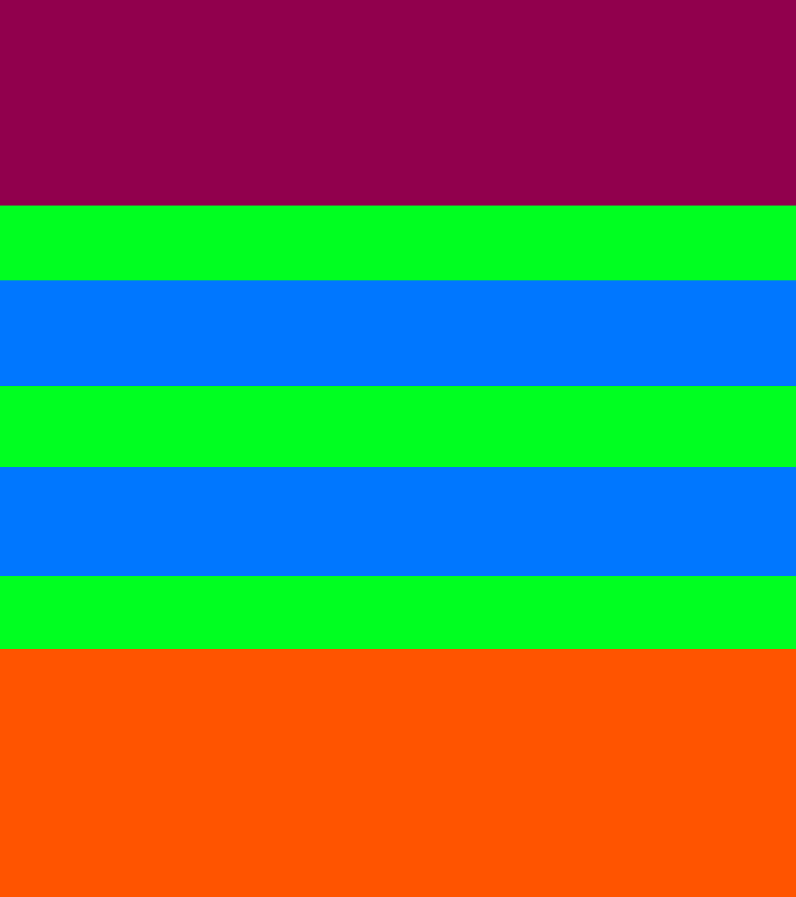

# Splitter

## Introduction

Splitter is a procedural building generator implemented for Unity in C#.
It uses _split grammar_ for generating buildings which are read from a rule file written in specific format. This rule file can be generated from an input image of a building facade along with a layout image that describes the elements on the facade. When the rules are generated in this way textures are automatically extracted and can be used for the generation process.

Two example images of facades along with layout images are provided. One is a bit simpler while the other is a bit more detailed.

To read more about the concepts the program is build upon please read the
Master's Thesis this implementation was made as part of. <Link to be provided>

As a disclaimer the theory and ideas behind the main algorithms are not my own. Proper acknowledgement is given in the Master's Thesis.

## Quickstart

It is recommended to create a fresh project and import __splitter.unitpackage__ by going to _Assets_ -> _Import Package_ -> _Custom Package_. 

To understand the flow of the generator two example facades are given. Navigate to the __InverseRuleGeneration__ scene and run the scene. Optionally provide names and Z-values for each element on the facade or just skip it by pressing Next repeatedly. When all the elements a facade have been processed the rule generation will begin and be written to the rules.txt file.

When this is done for both facades, navigate to the __Preview__ scene. If you run the scene the generator will read the produced rules and start the generation process for both buildings. When it is done you will see the two produced buildings.

## How to use

The first thing that needs to be done is to get an image of a facade and create a layout image for it. The layout image should consist of colored rectangles where each rectangle describes a certain element on the facade such as windows, doors or simply the wall. All elements of the same type should have the same color. It is important that the layout is well formed and of the exact same size as the original picture or else the generation will fail.

To generate rules for a given facade image it is easiest to simply navigate to the __InverseRuleGeneration__ scene. Here you can create a new GameObject with an __Input Facade__ object or simply test the ones available. The Input Facade field inside the object should be the facade wall image as a texture. The __Facade Layout Name__ should be a path to layout image relative to the Assets folder. See the _ExampleHouse_ object in the scene for an example. The name of your input facade GameObject will be the name used for your building.

When pressing play in the scene you will be prompted with providing the name and depth value for all different
colored regions in the layout. Note that the Z-value should be kept relatively small for a good result - often below 0.5. 

When this is done the rule generation process will begin and if all goes well the resulting rules will be written to _rules.txt_ in the Assets folder. 

After generating the rules you can move to the __Preview__ scene. Here you can see how the objects of the example houses are formed and create your own house (or simply rename the example houses to your chosen building name). Pressing play will start the generation process and you should see your building.

To reset the generated rules, just remove or edit the __rules.txt__ file and remove __GeneratedTextures__ in the __Textures__ folder.

## Limitations

The main limitation of this project is the sensitivity of the rule generator. If it can not at any time split the layout image vertically or horizontally such that it does not cut through any colored rectangle it will fail. Please keep this in mind when designing layout images. Ideally the generator could be improved to intelligently work around these situations in the future.

The generated buildings can also be resource intensive depending on how many elements the facade consists of. The more detailed a provided layout image is the more elements will be produced.

## Comments

As this project was done as a part of a master's thesis the focus has more been on the algorithms themselves and results rather than user friendliness. This is why the user experience might seem a bit unintuitive and unstable since it was not mainly intended for other users. But still, please feel free to download, experiment and provide feedback.
